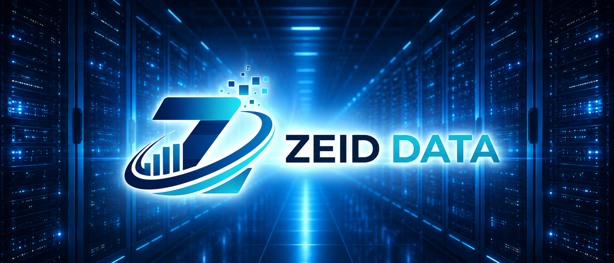

<!-- ZEID DATA README HERO START -->


<p align="center">
  <a href="./content"></a>
  <a href="./detections"></a>
  <a href="./docs"></a>
  <a href="./projects"></a>
  <a href="./research"></a>
  <a href="./tools/scripts"></a>
  <a href="./workbooks"></a>
  <a href="https://zeiddata.com"></a>
  <a href="./SECURITY.md"></a>
</p>
<!-- ZEID DATA README HERO END -->

# Zeid Data Research

<p align="center">
  Security research, detection engineering, data tooling, automation, and public-safe experiments.
  <br>
  Built for receipts, not vibes. The robot is friendly. The pipeline is not.
</p>

<p align="center">
  
  
  
  
</p>

---

## What this repo is

This is the public Zeid Data research lab for security-focused software, analytics workflows, detection engineering, malware research notes, automation scripts, templates, white papers, and workbook artifacts.

The operating model is simple:

```text
collect -> normalize -> analyze -> validate -> document -> ship with receipts
```

If a tool cannot explain what it read, what it changed, and what evidence supports the output, it gets escorted back to the lab bench by a disappointed robot.

<!-- ZEID DATA LAB MAP START -->
## Lab Map

| Area | What it is for | Docs |
|---|---|---|
| [Content](./content) | Vendor packs, field guides, governance content, and reusable evidence material. | [`content/README.md`](./content/README.md) |
| [Detections](./detections) | Detection rules, defensive analytics, signal logic, and security queries. | [`detections/README.md`](./detections/README.md) |
| [Docs](./docs) | Design notes, standards, implementation notes, and operating guidance. | [`docs/README.md`](./docs/README.md) |
| [Projects](./projects) | Project workspaces, prototypes, and active experiments. | [`projects/README.md`](./projects/README.md) |
| [Research](./research) | Research material, malware analysis, white papers, and experiments. | [`research/README.md`](./research/README.md) |
| [Scripts](./tools/scripts) | Automation helpers, validators, collectors, and repeatable operations. | [`tools/scripts/README.md`](./tools/scripts/README.md) |
| [Templates](./templates) | Reusable documentation, reporting, and delivery templates. | [`templates/README.md`](./templates/README.md) |
| [Workbooks](./workbooks) | Dashboard, workbook, and visual analytics artifacts. | [`workbooks/README.md`](./workbooks/README.md) |
| [Security Policy](./SECURITY.md) | Security reporting and supported vulnerability disclosure path. | [`SECURITY.md`](./SECURITY.md) |
| [License](./LICENSE.md) | Repository usage terms and attribution requirements. | [`LICENSE.md`](./LICENSE.md) |
<!-- ZEID DATA LAB MAP END -->

<!-- ZEID DATA TAGS START -->
### Tags

          

<!-- ZEID DATA TAGS END -->

## Current documentation standards

The documentation refresh adds a clearer structure for keeping the repo current:

- [`docs/README.md`](./docs/README.md) is the documentation index.
- [`docs/taxonomy.md`](./docs/taxonomy.md) defines what belongs where.
- [`docs/standards/evidence.md`](./docs/standards/evidence.md) defines what counts as traceable evidence.
- [`docs/automation.md`](./docs/automation.md) proposes scheduled maintenance for inventories, stale-doc checks, link checks, and weekly digest drafts.

## Featured operating principles

<details open>
<summary><strong>Evidence first</strong></summary>

Outputs should be traceable to inputs. Prefer structured results, stable schemas, reproducible runs, and documented assumptions over hand-wavy "seems fine" engineering.
</details>

<details>
<summary><strong>Defensive and authorized</strong></summary>

Security material in this repository is intended for authorized research, defensive testing, privacy review, detection engineering, and audit workflows. It is not a guide for credential theft, unauthorized access, stealth, evasion, abuse, or bypassing protections.
</details>

<details>
<summary><strong>Automation with guardrails</strong></summary>

Scripts should be non-interactive where possible, explicit about inputs and outputs, safe to run in controlled environments, and clear about failure modes. If a command can break something, it should say what it touches before it touches it.
</details>

<details>
<summary><strong>Robot humor, human accountability</strong></summary>

The lab voice can be weird. The engineering cannot be. Jokes are allowed. Fake claims are not.
</details>

## How to use this repo

Start by inspecting the area that matches your goal.

```bash
git clone https://github.com/zeiddata-dev/Research.git
cd Research

find . -maxdepth 2 -name README.md -print | sort
find . -maxdepth 2 -type f \( -name 'requirements*.txt' -o -name 'pyproject.toml' -o -name 'package.json' -o -name 'Makefile' \) -print | sort
```

Then read the module-level documentation before running tools. Different folders may have different requirements, assumptions, and safety boundaries.

## Quality bar

Good additions should include:

- A clear purpose.
- Safe default behavior.
- Public-safe documentation.
- Reproducible commands or tests where applicable.
- Machine-readable output when the artifact is meant for automation.
- Explicit assumptions and limits.
- No secrets, tokens, private URLs, private logs, or personal data.

## Recommended update cadence

Use automation to keep the repo current without allowing automation to invent research.

| Cadence | Action | Output |
|---|---|---|
| Weekly | Build documentation inventory and link-check report. | PR updating generated docs inventory. |
| Weekly | Draft repo activity digest from changed files and merged PRs. | Draft Markdown digest for review. |
| Monthly | Flag stale docs based on `last_reviewed` metadata. | Issue or PR listing review-needed docs. |
| Pull request | Check README coverage for new folders. | Pass/fail report with missing documentation fields. |

Start with the inventory job from [`docs/automation.md`](./docs/automation.md). It gives the highest signal with the lowest risk.

## Security and responsible disclosure

Do not open public issues for sensitive vulnerabilities. Use the repository security policy for reporting guidance: [`SECURITY.md`](./SECURITY.md).

Security research in this repo should remain authorized, defensive, and privacy-preserving. The lab does not need surprise crimes in the test suite.

## GitHub profile draft

This repository is not the special `.github` profile repository, so the reusable profile README draft lives here:

[`docs/guides/profile-readme.md`](./docs/guides/profile-readme.md)

Copy that file into `.github/profile/README.md` in the Zeid Data GitHub profile repository when ready.

## Maintainer notes

- Keep links real.
- Keep examples sanitized.
- Keep claims tied to repo contents.
- Keep generated assets local when practical.
- Keep the robot jokes, but do not let them drive architecture.

## License

This repository uses the MIT License unless a subfolder states otherwise. See [`LICENSE.md`](./LICENSE.md).
