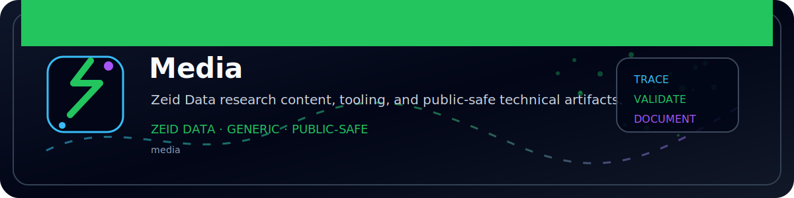

<!-- ZEID DATA README BANNER START -->

  

<!-- ZEID DATA README BANNER END -->

# Zeid Data Media

This folder contains **public, non-sensitive** assets used across the Zeid Data GitHub repositories and documentation. Keep visuals centralized, reusable, and linkable so projects, research modules, and drops can reference the same source of truth.

## What belongs here

Store assets here if they are:
- referenced by multiple READMEs, docs, or research write-ups
- used in Zeid Data drops and share collateral
- safe for public release (no secrets, no customer identifiers)

Common examples:
- architecture and data-flow diagrams (PNG/SVG)
- detection engineering diagrams (sequence flows, correlation graphs)
- sanitized screenshots of dashboards, queries, and tool output
- Zeid Data brand-safe assets (marks, icons, banners)
- social images for drops (hero images, thumbnails, preview cards)

## What must NOT be committed

Do not commit anything that could reveal private environments or identifiers, including:
- API keys, tokens, credentials, cookies
- customer data: names, domains, email addresses, usernames
- real IPs/hostnames/asset tags from client networks
- screenshots showing tenant IDs, account IDs, billing IDs, internal URLs
- raw logs or PCAPs from production environments
- system details that can fingerprint an operator machine (tabs, tray icons, notifications)

If an image is required for explanation, sanitize it first and document what was redacted.

## Recommended structure

Keep subfolders generic and scalable:

- `assets/images/brand/`  
  Zeid Data public brand assets used in README headers and drop banners.

- `assets/images/diagrams/`  
  Architecture, threat model, sequence diagrams, and correlation flows.

- `assets/images/screenshots/`  
  Sanitized screenshots of SIEM/EDR queries, dashboards, workbooks, and tool outputs.

- `assets/images/social/`  
  Drop collateral and share images (banners, thumbnails, preview cards).

Optional (only when needed):
- `assets/images/source/`  
  Source design files (Figma/AI/PSD). Always export a PNG/SVG for usage.

## Naming rules

Use **kebab-case** and descriptive names. Keep filenames stable because other repos/docs may link to them.

✅ Good
- `assets/images/diagrams/tls-sni-egress-correlation-flow.svg`
- `assets/images/screenshots/splunk-dashboard-ai-egress-baseline.png`
- `assets/images/brand/zeid-data-mark.svg`

❌ Avoid
- `final.png`
- `image(1).png`
- `newbanner2.png`

### Drop-specific assets

If an asset is tied to a drop or announcement, prefix it with the drop date:

- `assets/images/social/2026-02-08-claude-detection-hero.png`
- `assets/images/social/2026-02-08-claude-detection-banner.png`

## Formats and quality

Preferred formats:
- **SVG** for diagrams and marks (crisp, diff-friendly)
- **PNG** for screenshots (lossless text)

Guidance:
- crop screenshots to the relevant panel
- keep text readable at typical GitHub widths
- compress large images without blurring text
- avoid embedding sensitive metadata (some tools store author/location data)

## Redaction requirements

Before committing any screenshot:
- remove tenant IDs, account IDs, user IDs, emails, domains
- redact IPs/hostnames unless they are public and intentional
- remove internal URLs and query strings
- crop out browser tabs/bookmarks and desktop notifications
- prefer synthetic or lab data where possible

If redactions are significant, note it in the referencing README:
- “Screenshot sanitized (tenant IDs and usernames redacted).”

## Referencing media in Markdown

Use relative paths from the file you are editing:

Example:
``

When in doubt, keep media in this folder and reference it rather than copying images into each module.

## Change policy

Because assets may be referenced externally:
- do not rename or delete files without updating every reference
- if you need a new version, add a new file and update links deliberately
- keep old assets if they were used in past drops for historical integrity

## Quick checklist

- [ ] public and sanitized
- [ ] kebab-case filename
- [ ] readable at GitHub size
- [ ] reasonable file size
- [ ] references use correct relative paths
