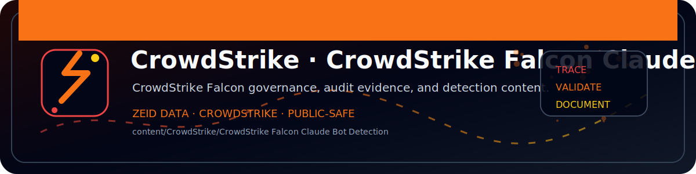

<!-- ZEID DATA README BANNER START -->

  

<!-- ZEID DATA README BANNER END -->

# CrowdStrike — Claude/Anthropic (Endpoint) detection pack

Attribute Claude/Anthropic usage to endpoint user + initiating process (DNS telemetry).

Included:
- FQL hunts in `event_search/`
- Dashboard widget blueprint in `dashboards/`
- Reporting guidance in `reports/`
