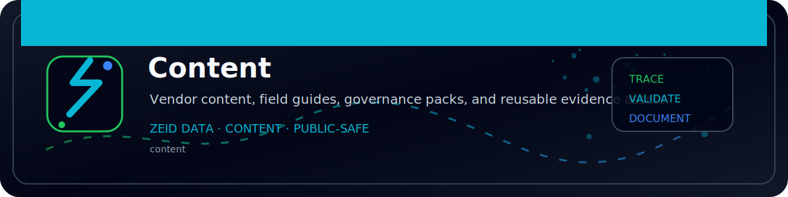

<!-- ZEID DATA README BANNER START -->

  

<!-- ZEID DATA README BANNER END -->

# Zeid Data — Network Security (Vendor Content)

Welcome to Zeid Data’s vendor-organized **network security** repository: hardening guidance, configs, detection ideas, runbooks, and “here’s the proof” validation artifacts—grouped by the tech you actually run.

If it didn’t generate evidence, it didn’t happen. 🧾🔒

---

## What this repo is for

This repo is a practical library of **deployable** and **reviewable** network security content, organized **by vendor** so you can quickly find:

- Baseline hardening (secure defaults, recommended toggles, pitfalls)
- Reference configurations (templates you can adapt, with commentary)
- Validation steps (commands/queries to prove the control is enabled)
- Detection + monitoring patterns (SIEM-friendly ideas and fields)
- Operational runbooks (change control, rollback, break-glass notes)
- Audit-ready evidence checklists (what to capture, how to package it)

---

## Directory layout (vendor-first)

Each vendor gets its own folder. Inside, content is separated by type and kept as close to “copy/paste usable” as possible.

