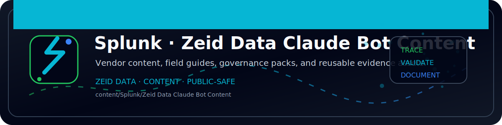

<!-- ZEID DATA README BANNER START -->

  

<!-- ZEID DATA README BANNER END -->

# Splunk — Claude/Anthropic (Firewall + Endpoint) pack

Included:
- lookup: `lookups/claude_domains.csv`
- searches: `spl/`
- dashboard: `dashboards/claude_firewall_endpoint_dashboard.xml`
- ES examples: `splunk_es/savedsearches.conf`
- reporting notes: `reports/report_searches.md`

Assumptions:
- firewall logs in `index=firewall`
- endpoint logs (CrowdStrike example) in `index=crowdstrike`
Adjust SPL to your environment.
