<!-- ZEID DATA README HERO START -->

  

  
  
  
  
  
  
  
  

<!-- ZEID DATA README HERO END -->

# Zeid Data Cisco Free Content Pack

Evidence-first detection content for Cisco telemetry. This folder is designed to help you turn Cisco logs into repeatable, audit-ready security detections and simple reporting outputs.

## What this is
A practical starter kit you can deploy quickly using logs you already have from Cisco security and networking products. The goal is to reduce time-to-detection and standardize evidence capture.

## What’s included (general)
This pack is intentionally modular. Content may include some or all of the following, depending on what telemetry you have enabled:

- Detection logic (queries, rules, and filters) for suspicious network behavior
- Reference allowlist/denylist patterns and tuning notes
- Field mapping notes for common Cisco log schemas
- Validation checklist and test cases
- Optional dashboards or reporting templates (platform-dependent)

## Supported Cisco telemetry (common sources)
You can use this pack with one or more of these data sources:

- Cisco Secure Firewall / Firepower (FTD) connection events
- ASA firewall logs (if still in use)
- Cisco Umbrella DNS logs
- Cisco Secure Endpoint (AMP) event telemetry
- Cisco Secure Network Analytics (Stealthwatch) flow/behavior signals
- Cisco Duo authentication logs
- Cisco Email Security / Web Security (where applicable)
- NetFlow/IPFIX exports from Cisco network devices (if collected)

If you only have one source (for example DNS from Umbrella), you can still get value. The detections are written to degrade gracefully when certain fields are missing.

## Use cases this pack targets
Examples of the kinds of behaviors you can detect with Cisco logs:

- Unusual outbound destinations (new domains, new ASNs, rare countries)
- Suspicious DNS patterns (DGA-like, newly registered domains, high NXDOMAIN rates)
- TLS/HTTPS anomalies (rare SNI, unusual JA3/JA4 when available via your stack)
- Beaconing patterns and periodic outbound traffic
- Authentication anomalies (impossible travel, new device, repeated failures)
- Endpoint execution or lateral movement signals (if Secure Endpoint is present)

