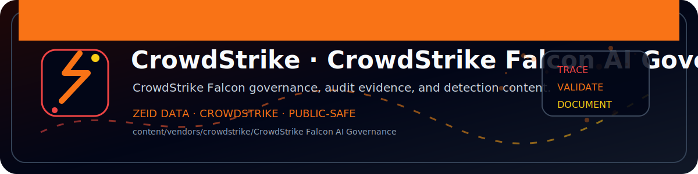

<!-- ZEID DATA README BANNER START -->

  

<!-- ZEID DATA README BANNER END -->

# Zeid Data — CrowdStrike Falcon AI Governance Visibility

**Tagline:** _If it didn’t generate evidence, it didn’t happen._

This package delivers **AI usage visibility** and **policy-oriented governance views** using CrowdStrike telemetry in **Falcon LogScale / Next-Gen SIEM**.

It is intentionally “governance-first”:
- **What AI tools are being used**
- **Who / where they are being used**
- **Whether usage is sanctioned (allowlisted)**
- **Audit-friendly evidence queries** you can export

> This is a **library** package: it provides dashboard *templates* + saved searches you can install and customize.

---

## What’s Included

### Dashboards (Templates)
1. **AI Governance — Overview**
   - AI domain hits over time
   - Top users / hosts
   - Sanctioned vs unsanctioned breakdown (lookup-driven)

2. **AI Governance — Tool Usage & Policy**
   - AI desktop app execution (lookup-driven)
   - Unsanctioned tools by host/user
   - “New / unknown” AI domains (domain list gaps)

3. **AI Governance — Data Exposure Signals**
   - AI usage side-by-side with common data-movement tooling
   - Outbound tooling hotspots (who/where to investigate first)

### Saved Searches
- Evidence-ready searches for:
  - AI domain usage (top users/hosts)
  - Unsanctioned AI usage
  - AI app execution
  - “New/unknown domain” candidates for triage

### Lookup Files (Editable)
- `data/ai_domains.csv` — AI-related domains with vendor/category/sanctioned flags
- `data/ai_apps.csv` — AI-related executables with vendor/category/sanctioned flags
- `data/data_movement_tools.csv` — common export/egress tooling (optional signals)

---

## Requirements

- Falcon LogScale repository containing **CrowdStrike telemetry** (FDR/FLTR/NG-SIEM feeds).
- The dashboards assume common CrowdStrike fields are present (examples):
  - `#event_simpleName` (e.g., `DnsRequest`, `ProcessRollup2`, `NetworkConnectIP4`)
  - `ComputerName`, `UserName`
  - `DomainName` (for DNS events)
  - `ImageFileName` (for process events)

If your data uses different field names, open any dashboard template and update the field references.

---

## Quick Start

1. Import the package into LogScale (as a **library** package).
2. Create dashboards **from templates**:
   - Dashboards → **New dashboard** → **From template / package**
3. Open a dashboard and leave defaults as-is (they use `*` wildcards).
4. Customize allowlist policy:
   - Edit `data/ai_domains.csv` and `data/ai_apps.csv` to match your org’s sanctioned tools.
5. Export evidence:
   - Run saved searches from `queries/` and export results as CSV for audit packets.

---

## Governance Workflow (Recommended)

- **Weekly:** review “Unsanctioned AI Usage” widget → open top hosts/users
- **Daily:** monitor “New/Unknown AI Domains” candidates → decide allow/deny
- **Monthly (Audit):** export evidence searches and attach to governance artifacts

---

## Notes & Caveats

- DNS-based visibility captures **domain access intent**, not necessarily data shared.
- Many orgs also ingest proxy, firewall, CASB, and DLP logs — this package stays endpoint/telemetry-centric by default, but you can extend queries to include those sources.
- Lookups are starter lists. Your environment will require tuning.

---

## License

Zeid Data (see `LICENSE`).
Apache 2.0 (see `LICENSE`).
