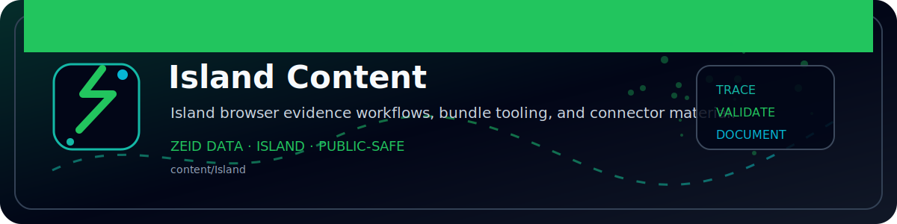

<!-- ZEID DATA README BANNER START -->

  

<!-- ZEID DATA README BANNER END -->

# Island — General Content Repo 🏝️📦

Welcome to the **Island General Content Repo** — the place where content goes to either:

1) become useful, or  
2) sit quietly in version control until the heat death of the universe. 😌

If you’re here to find “the latest final_final_v7 approved copy”… good news: we don’t do that here.  
We do **history**, **diffs**, and **accountability**. Like adults. Mostly. 🙃

---

## What this repo is 🧠
A centralized dumping ground (affectionately) for **general-purpose content**:
- docs
- blurbs
- templates
- snippets
- notes
- drafts
- guidelines
- things we swear we’ll organize later

This is the repo equivalent of a junk drawer — except searchable, reviewable, and less likely to contain a loose battery. 🔋

---

## What you’ll find inside 🗂️
Typical content buckets might include:

- `docs/` — documentation, references, “please read this before asking”
- `templates/` — reusable templates (the “do less work” starter pack)
- `copy/` — generic copy blocks, descriptions, bios, boilerplate, etc.
- `snippets/` — short chunks, reusable phrases, micro-assets
- `assets/` — images, logos, diagrams (if we’re feeling fancy)
- `archive/` — things we’re not deleting, but also not endorsing 😬

If your folder isn’t listed: congrats, you’ve discovered **organic repo evolution**. 🌱

---

## How to use it ✅
1. **Search first** (Ctrl+F is cute, but repo search is cuter).
2. Copy what you need.
3. If you change something, **commit it with a message that isn’t “update.”**  
   (Yes, this is personal.) 😐

---

## Ground rules 🧾
- **No secrets.** If it’s sensitive, it doesn’t belong here.
- **No mystery meat.** Add context in the doc or in the commit message.
- **One concept per file** where possible.
- **Prefer Markdown** unless there’s a reason not to.
- **Name files like a person who wants to be found later.**
  - ✅ `brand_voice_guidelines.md`
  - ❌ `stuff.md`
  - ❌ `newnew2.md`
  - ❌ `final_ACTUALLY_FINAL.md` (liar)

---

## Contributing 🤝
PRs welcome. If you’re adding content:
- Put it in the right folder (or create one with a sane name).
- Add a short header section explaining:
  - what it is
  - who it’s for
  - when to use it
- Avoid “just vibes” documentation. We love vibes, but not in production. 😅

---

## Suggested commit messages 🧨
Because words matter:
- `add: onboarding template for [thing]`
- `fix: clarify tone rules in brand voice doc`
- `refactor: reorganize templates into categories`
- `docs: expand README usage notes`
- `chore: archive outdated campaign copy`

Try not to use: `update`, `changes`, `idk`, or `pls work`. 🫠

---

## Quality bar 🧼
This repo should feel like:
- clean enough to trust
- structured enough to scale
- not so strict that nobody uses it

We’re aiming for **“professional”** with a hint of **“we’ve been through things.”** 😮‍💨

---

## Security / Legal 🛡️⚖️
- No credentials, tokens, private keys, customer data, or “temporary” secrets.
- If content has legal implications, label it clearly and link to source policy.
- If you’re unsure: assume it’s sensitive and don’t commit it. 🔒

---

## Quick start (for the impatient) 🚀
- Need a template? Check `templates/`
- Need language blocks? Check `copy/` or `snippets/`
- Need to understand why things are the way they are? `docs/` (good luck) 😄

---

## Contact / Ownership 🧭
If something is unclear, outdated, or cursed:
- open an issue
- tag an owner (if we have one)
- or fix it and submit a PR like the hero you pretend you’re not 🦸

---

### Motto
> “If it’s not versioned, it didn’t happen.” 😈

Enjoy the island. Don’t feed the wild drafts. 🏝️📝
