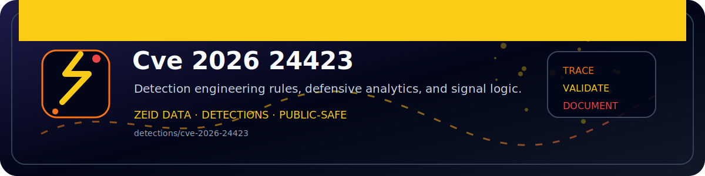

<!-- ZEID DATA README BANNER START -->
<p align="center">
  
</p>
<!-- ZEID DATA README BANNER END -->

# zeid_data_CVE-2026-24423

Defensive-only detector for SmarterMail exploitation attempts associated with **CVE-2026-24423**.

## What it does

Scans for:
- Requests to `/api/v1/settings/sysadmin/connect-to-hub`
- Hub setup-initial-connection paths (`/web/api/node-management/setup-initial-connection` and older `/web/api/hub-connection/setup-initial-connection`)
- App-log markers such as “Connecting to hub” (if you provide SmarterMail logs)
- Optional: egress/proxy log matches for hub setup paths

## Inputs

- Web access logs (IIS W3C or common/combined)
- Optional SmarterMail logs (plain text)
- Optional egress/proxy logs (plain text)

## Quick start

```bash
python3 zeid_data_CVE-2026-24423.py --web-log access.log --out findings.json
```

## Safety

Read-only parsing. No exploitation. No network calls.

## Files

- `zeid_data_CVE-2026-24423.py`
- `HOWTO.md`
- `LICENSE`
