<!-- ZEID DATA README HERO START -->
<p align="center">
  
</p>

<p align="center">
  <a href="../../../README.md"></a>
  <a href="../../../content"></a>
  <a href="../.."></a>
  <a href="../../../docs"></a>
  <a href="../../../projects"></a>
  <a href="../../../scripts"></a>
  <a href="../../../workbooks"></a>
  <a href="https://attack.mitre.org/"></a>
</p>
<!-- ZEID DATA README HERO END -->

# zeid_data_CVE-2026-24858

Defensive-only log hunting tool for **Fortinet FortiCloud SSO abuse** associated with **CVE-2026-24858**.

## What it does

Flags two high-signal Fortinet event patterns described in public incident reporting:

- **Admin login successful** events where `method="sso"` and `ui="sso(<ip>)"`
- **Local admin creation** where `cfgpath="system.admin"` and `action="Add"`

The script includes a small IOC starter set (SSO usernames, IPs, and suspicious admin names) and lets you extend it via CLI flags.

## Inputs

- FortiOS/FortiGate-style event logs in text form (key=value pairs)

## Quick start

```bash
python3 zeid_data_CVE-2026-24858.py --log fortinet.log --out findings.json
```

Extend IOCs without editing code:

```bash
python3 zeid_data_CVE-2026-24858.py --log fortinet.log \
  --extra-ioc-ip 203.0.113.10 \
  --extra-admin-name netopsadmin \
  --extra-sso-user attacker@example.com \
  --out findings.json
```

## Output

JSON findings to stdout (default) or `--out`.

## Safety

Read-only parsing. No network calls. No exploitation.

## Files

- `zeid_data_CVE-2026-24858.py`
- `HOWTO.md`
- `LICENSE`
