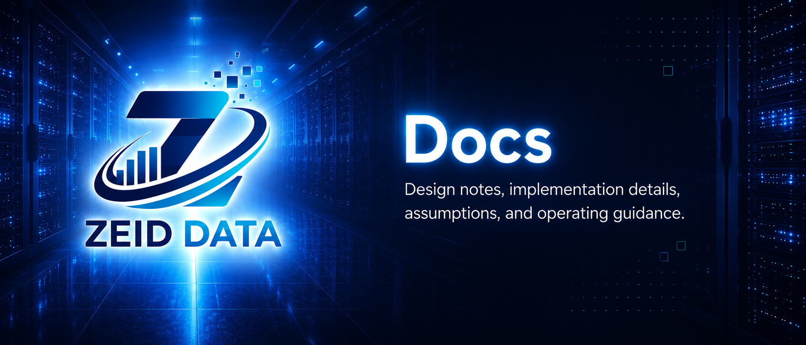

<!-- ZEID DATA README HERO START -->


<p align="center">
  <a href="../README.md"></a>
  <a href="../content"></a>
  <a href="../detections"></a>
  <a href="../projects"></a>
  <a href="../research"></a>
  <a href="../tools/scripts"></a>
  <a href="../workbooks"></a>
</p>
<!-- ZEID DATA README HERO END -->

# Zeid Data Research Docs

This folder explains how the public research repo is organized, how documentation should be written, and how updates should stay current without turning the repo into a junk drawer with a badge collection.

## Start here

| Document | Purpose |
|---|---|
| [`automation.md`](./automation.md) | Suggested weekly/monthly automation for keeping docs, indexes, and research summaries current. |
| [`taxonomy.md`](./taxonomy.md) | What belongs in each top-level folder and how to classify new work. |
| [`standards/evidence.md`](./standards/evidence.md) | Evidence requirements for tools, detections, reports, and published artifacts. |
| [`guides/profile-readme.md`](./guides/profile-readme.md) | Reusable GitHub profile README draft. |

## Documentation quality bar

Every useful doc in this repo should answer five questions quickly:

1. What is this for?
2. Who should use it?
3. What inputs, assumptions, or dependencies does it need?
4. What evidence, outputs, or validation does it produce?
5. When was it last reviewed, and what still needs work?

If a document cannot answer those questions yet, mark the missing parts clearly. Do not fill gaps with fake certainty.

## Current maintenance model

The repo should stay current through small, repeatable updates:

- Add or refresh folder-level `README.md` files when a new area appears.
- Keep links relative and testable.
- Prefer short metadata blocks over long prose when a page needs to be indexed automatically.
- Put operational standards in `docs/` and reusable forms in `templates/`.
- Keep public-safe summaries in the repo. Keep private evidence, customer data, secrets, and sensitive logs out of the repo.

## Suggested front matter for future docs

Use this block when a doc needs to be tracked by automation:

```yaml
---
title: Example Research Note
status: draft
owner: zeid-data
last_reviewed: 2026-05-31
category: research
tags: [security-research, detection-engineering, evidence]
public_safe: true
---
```

Automation can later scan these fields to build indexes, stale-doc reports, public release notes, and weekly research digests.
