<!-- ZEID DATA README HERO START -->

  

  
  
  
  
  
  
  
  

<!-- ZEID DATA README HERO END -->

<h1 align="center">Zeid Data</h1>

  Security research, data tooling, automation, detection engineering, and public-safe technical experiments.

  <a href="https://github.com/zeiddata-dev/Research">Research Lab</a>

## What we build

Zeid Data works on evidence-first software and research artifacts:

- Defensive security tooling.
- Detection engineering and governance analytics.
- Data normalization, validation, and reporting workflows.
- Automation scripts with clear inputs, outputs, and failure modes.
- Public-safe research notes, templates, white papers, and workbook artifacts.

## Current public lab

The main public landing repository is:

[`zeiddata-dev/Research`](https://github.com/zeiddata-dev/Research)

That repo organizes work across projects, detections, malware research, scripts, documentation, templates, white papers, and workbooks.

## Operating rules

- Authorized and defensive research only.
- Receipts over vibes.
- Real links over decorative nonsense.
- Sanitized examples only.
- Clear assumptions and reproducible outputs.
- Robot humor allowed. Fake claims denied.

## Security

Please do not open public issues for sensitive vulnerabilities. Use the security policy in the relevant repository.
