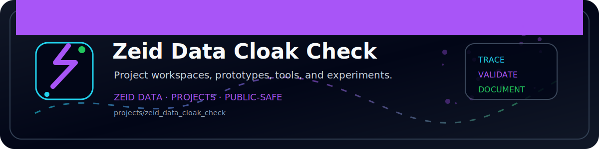

<!-- ZEID DATA README BANNER START -->
<p align="center">
  
</p>
<!-- ZEID DATA README BANNER END -->

# Zeid Data CloakCheck Pack

> Cloaked phishing via server side filtering: the kit looked at you, decided you weren’t worth scamming, and served you the kiddie menu. Congrats, you “never saw the real page.” 🥰

This repo style drop includes (aka: the stuff your gateway swore it already covered):

* A **differential URL fetch** script that hits the same URL with multiple client profiles and then **snitches on the differences**
* Detection templates (**Splunk, Sentinel, Elastic, Sigma**) because everyone deserves copy paste therapy
* IOC schemas (**CSV/JSON**) + a tiny **STIX 2.1** bundle example for the standards enjoyers
* A mini whitepaper (**Markdown + PDF**) so you can pretend this was planned
* A **scorecard + evidence bundle template** to make auditors feel safe inside
* A **LinkedIn post** you can paste and ship like it’s a “content strategy”

## Quick start (don’t overthink it)

1. Create a venv and install deps (yes, you still have to do this part):

```bash
python -m venv .venv
# Windows: .venv\Scripts\activate
source .venv/bin/activate
pip install -r zeid_data_requirements.txt
```

2. Run differential fetch (aka: “show me what the kit shows different victims”):

```bash
python tools/scripts/zeid_data_differential_fetch.py --url "https://example.com/suspicious" --out runs
```

3. Compare runs (aka: “prove it with receipts”):

```bash
python tools/scripts/zeid_data_compare_runs.py --runs runs --report runs/zeid_data_comparison_report.md
```

## What “CloakCheck” is looking for (the fun parts)

* Redirect chains that change based on **User-Agent / Accept-Language / Referrer** (because phishing has preferences)
* **Content hash** and **content-length drift** across “profiles” (same URL, different reality)
* Sketchy **30x hopscotch**, especially into **newly observed domains** (freshly registered nonsense)
* “Clean for scanners” behavior: **benign page for bots**, **kit page for humans** (security theater, now in 4K)

## Safety / ethics (don’t be weird)

Use this only on URLs you’re authorized to test: your org, your lab, or with explicit permission.
This pack is for **detection and analysis**, not exploitation. If you came here for evil, wrong aisle.

## Layout (where the bodies are buried)

* `tools/scripts/` — collection + comparison tools
* `detections/` — starter queries + Sigma rule
* `templates/` — IOC schemas + STIX example
* `checklists/` — scorecard + evidence bundle template
* `data/` — small synthetic sample telemetry for demo/training
* `zeid_data_whitepaper.*` — mini whitepaper (for the stakeholders)

## License

MIT — see `LICENSE.txt` (because we’re generous like that)
