<!-- ZEID DATA README HERO START -->
<p align="center">
  
</p>

<p align="center">
  <a href="../../../README.md"></a>
  <a href="../../../content"></a>
  <a href="../../../detections"></a>
  <a href="../../../docs"></a>
  <a href="../.."></a>
  <a href="../../../scripts"></a>
  <a href="../../../workbooks"></a>
  <a href="https://zeiddata.com"></a>
</p>
<!-- ZEID DATA README HERO END -->

# Zeid Data GapCheck (Air‑Gap Network Compliance Evidence Collector)

An offline-first CLI tool that collects **host-based network evidence** to help prove an environment is *air‑gapped* (or to identify where it isn’t). It produces a timestamped evidence bundle (raw command output + normalized JSON + human‑readable Markdown) suitable for audit attachments.

## Quick start
```bash
python gapcheck.py run --policy policy.sample.json --output ./evidence
```

## Authorized use only
Run this tool only on systems and networks you are authorized to assess.
