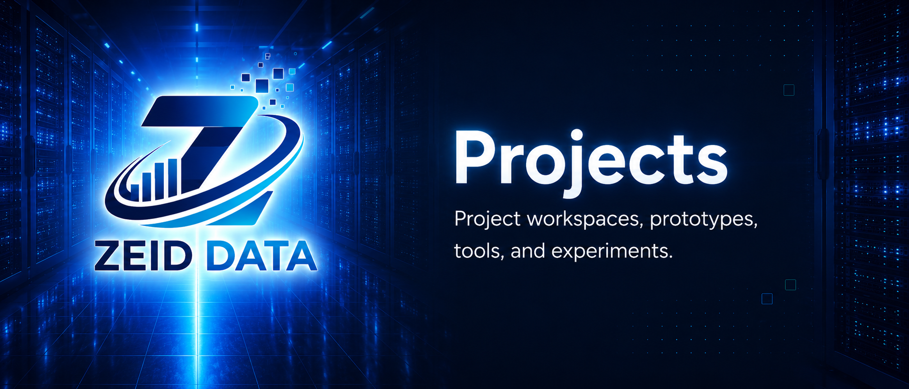

<!-- ZEID DATA README HERO START -->


<p align="center">
  <a href="../../../README.md"></a>
  <a href="../../../content"></a>
  <a href="../../../detections"></a>
  <a href="../../../docs"></a>
  <a href="../.."></a>
  <a href="../../../scripts"></a>
  <a href="../../../workbooks"></a>
  <a href="https://zeiddata.com"></a>
</p>
<!-- ZEID DATA README HERO END -->

<!-- ZEID DATA TAGS START -->
### Tags

       

<!-- ZEID DATA TAGS END -->

# Zeid Data - Copper Hang Back..
# comments: deposit ghost trace (copper)

In **C++**, a “stack overflow vulnerability” almost always means a **stack-based buffer overflow**: writing past the end of a **stack-allocated** array (often a `char buf[N]`) and corrupting adjacent stack data.

## What it looks like in C++

Typical risky patterns come from mixing C-style buffers/APIs into C++:

### Vulnerable example (classic)

```cpp
#include <cstring>

void greet(const char* input) {
  char name[16];
  std::strcpy(name, input);   // ❌ no bounds check
  // ...
}
```

If `input` is longer than 15 chars (+ null terminator), `strcpy` will keep copying and **overflow `name`**.

### Also common

* `sprintf`, `strcat`, `strncpy` (misused), `memcpy` with wrong length
* reading into `char buf[32]` without limiting size
* manual parsing that assumes “it’ll fit”
* `alloca()` or large local arrays (can also cause *non-exploit* stack exhaustion)

## Why it’s dangerous

The stack frame also holds **other locals** and **control data** used when the function returns. Overflowing a buffer can:

* flip booleans / change logic
* corrupt pointers
* crash the process
* (in worst cases) enable control-flow hijacking (harder today, still serious)

## The C++ way to prevent it

### Prefer safe types

* Use `std::string` for text, not `char[]`
* Use `std::array<std::byte, N>` / `std::vector` for binary buffers
* Use `std::span` to pass buffers + lengths explicitly

### Use bounded operations

```cpp
#include <string>

void greet(const std::string& input) {
  std::string name = input;   // ✅ grows safely
}
```

If you must use a fixed buffer:

```cpp
#include <array>
#include <algorithm>

void greet(const char* input) {
  std::array<char, 16> name{};
  std::size_t n = std::min(std::strlen(input), name.size() - 1);
  std::memcpy(name.data(), input, n);
  name[n] = '\0';
}
```

## Build-time defenses you should enable

### Clang/GCC (Linux/macOS)

* `-fstack-protector-strong`
* `-D_FORTIFY_SOURCE=2` (or 3 on newer toolchains)
* `-fPIE -pie`
* Linker hardening: `-Wl,-z,relro,-z,now`

### MSVC (Windows)

* `/GS` (stack cookies)
* `/DYNAMICBASE` (ASLR) + `/NXCOMPAT` (DEP)

## Finding these bugs fast

* **AddressSanitizer** (best first move): `-fsanitize=address -fno-omit-frame-pointer`
* **UBSan**: `-fsanitize=undefined`
* Static analysis: `clang-tidy`, `cppcheck`
* Turn warnings up: `-Wall -Wextra -Wpedantic` (and treat warnings as errors in CI)

