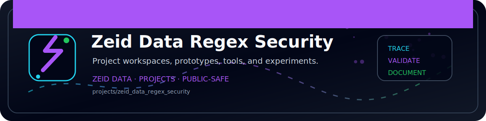

<!-- ZEID DATA README BANNER START -->

  

<!-- ZEID DATA README BANNER END -->

# Zeid Data Regex Security Education Bundle 🧪🛡️

This package contains defensive education content and lightweight tooling to help teams understand and test regex related security risks.

Because apparently `just a little regex` keeps ending up in security critical paths. 😅

## What’s Included 📦

* `zeid_data_regex_education.md`
  Full cybersecurity education post in plain English with toy examples

* `zeid_data_regex_security_research.md`
  Research notes and defensive rationale

* `zeid_data_broken_vs_safe_regex_examples.md`
  Side by side examples with safer alternatives

* `HOWTO.md`
  Usage guide for the included script

* `LICENSE.md`
  License text (MIT)

* `zeid_data_regex_safety_tester.py`
  Toy benchmark and heuristic checks for regex review

## Purpose 🎯

This bundle is for defensive education and engineering hygiene. It helps teams:

* identify risky regex patterns
* improve validation correctness
* reduce ReDoS risk
* encourage parser first trust decisions for URLs and domains

In short: fewer regex surprises, fewer production regrets.

## Safety Notes 🚧

* No live target exploitation guidance
* No illegal activity instructions
* All examples are toy examples
* The script is a helper, not a formal proof of safety

It is meant to help you catch obvious problems early, not replace engineering judgment, code review, or reality.

## Suggested Workflow ✅

1. Read the education post
2. Review the broken vs safe examples
3. Run the script on patterns used in your codebase
4. Add tests and logs
5. Replace fragile regex trust checks with structured parsing where possible

Regex is powerful.
It is also extremely literal and has no interest in your intentions. 🤖
