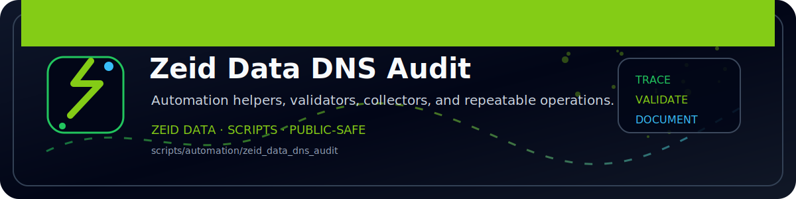

<!-- ZEID DATA README BANNER START -->

  

<!-- ZEID DATA README BANNER END -->

# zeid_data_dns_audit (Python)

Resolves hostnames to A/AAAA.

Outputs:
- `out/dns_audit.json`
- `out/dns_audit.csv`
