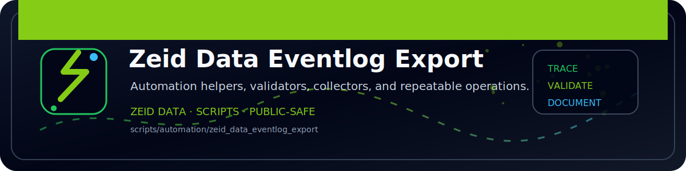

<!-- ZEID DATA README BANNER START -->

  

<!-- ZEID DATA README BANNER END -->

# zeid_data_eventlog_export (PowerShell)

Exports System/Application/Security logs for a time window.

Outputs timestamped:
- `out/eventlog_<LogName>_<timestamp>.json`
- `out/eventlog_<LogName>_<timestamp>.csv`
