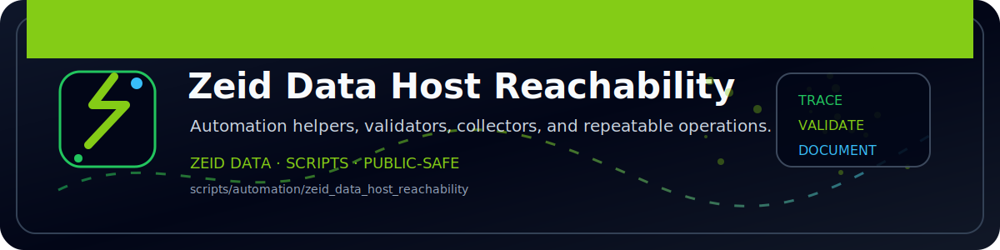

<!-- ZEID DATA README BANNER START -->

  

<!-- ZEID DATA README BANNER END -->

# zeid_data_host_reachability (Python)

Checks a list of hosts using your OS `ping`.

Outputs:
- `out/reachability.json`
- `out/reachability.csv`
