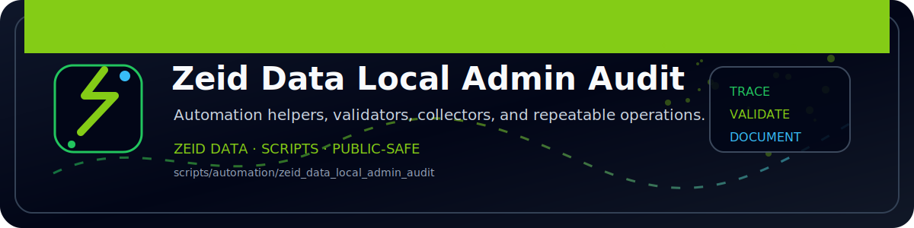

<!-- ZEID DATA README BANNER START -->

  

<!-- ZEID DATA README BANNER END -->

# zeid_data_local_admin_audit (PowerShell)

Outputs:
- `out/local_admin_audit.json`
- `out/local_admins.csv`
- `out/local_users.csv`
