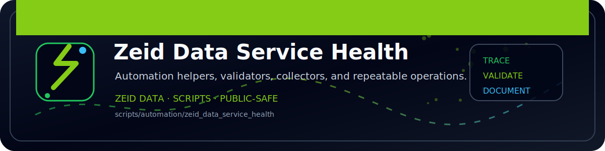

<!-- ZEID DATA README BANNER START -->

  

<!-- ZEID DATA README BANNER END -->

# zeid_data_service_health (PowerShell)

Checks services and writes evidence outputs.

Outputs:
- `out/service_health.json`
- `out/service_health.csv`
