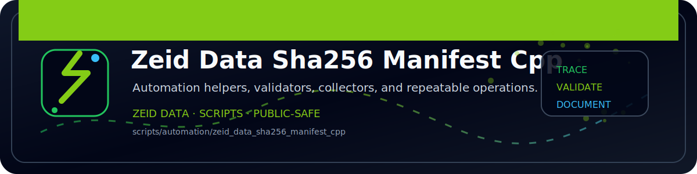

<!-- ZEID DATA README BANNER START -->

  

<!-- ZEID DATA README BANNER END -->

# zeid_data_sha256_manifest (C++)

Recursively hashes files and writes `manifest.csv`.

Because "these are the exact artifacts" should have fingerprints.

Output:
- `manifest.csv`
