<!-- ZEID DATA README HERO START -->

  

  
  
  
  
  
  
  
  

<!-- ZEID DATA README HERO END -->

# Zeid Data - Security Templates (Quick Guide)

This folder contains **ready-to-copy templates** you can use to standardize security work across teams—without reinventing the wheel each time.

## What’s in here
Common template types you may find:
- **Detection templates** (what to detect, data sources, logic, tuning)
- **Incident response templates** (triage steps, containment, evidence checklist)
- **Threat hunting templates** (hypothesis, queries, expected signals)
- **Risk & compliance templates** (controls, evidence, audit notes)
- **Change management templates** (what changed, why, impact, approvals)
- **Runbooks / playbooks** (step-by-step operational procedures)

## How to use these templates
1. **Copy** the closest template to your use case  
2. **Fill in** the environment-specific fields (vendor, log source, owner, severity)  
3. **Test** in a non-production or limited-scope context  
4. **Document** outcomes (false positives, gaps, tuning decisions)  
5. **Promote** to production with approvals and tracking

## Minimum fields to complete (most templates)
- **Owner / team**
- **Purpose** (what problem this solves)
- **Data sources** (DNS, EDR, firewall, SIEM, cloud logs, etc.)
- **Detection / procedure** (logic, steps, queries)
- **Severity + triage guidance**
- **Evidence to collect** (fields, screenshots, exports)
- **References** (tickets, policies, threat intel)

## Good habits
- Prefer **clear, repeatable steps** over long narratives
- Keep detections **measurable** (what signals, what threshold, what timeframe)
- Track changes with a **version + changelog**
- Design for **audit-ready outputs** (who, what, when, why, evidence)

## Disclaimer
These templates are **starting points**. Validate with your policies, legal/privacy requirements, and your production environment before use.
