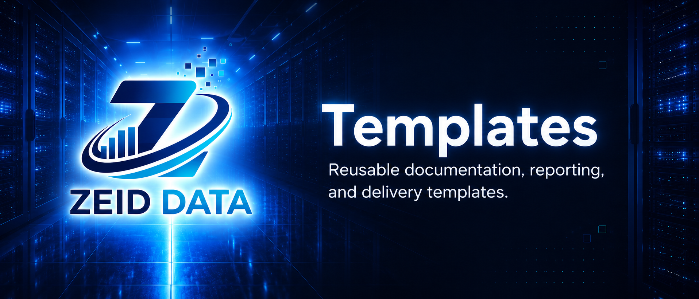

<!-- ZEID DATA README HERO START -->


<p align="center">
  <a href="../README.md"></a>
  <a href="../content"></a>
  <a href="../detections"></a>
  <a href="../docs"></a>
  <a href="../projects"></a>
  <a href="../tools/scripts"></a>
  <a href="../research"></a>
  <a href="../workbooks"></a>
</p>
<!-- ZEID DATA README HERO END -->

<!-- ZEID DATA TAGS START -->
### Tags

     

<!-- ZEID DATA TAGS END -->

# Zeid Data Security Templates

This folder contains ready-to-copy templates for repeatable security, audit, research, reporting, and operational work.

Templates should reduce ambiguity. A good template tells the next person what to collect, what to prove, what to fill in, what to leave blank when evidence is missing, and what should never be guessed.

## What belongs here

Common template types:

- Detection templates: behavior, data sources, logic, tuning, validation.
- Incident response templates: triage steps, containment, timeline, evidence checklist.
- Threat hunting templates: hypothesis, query set, expected signals, decision path.
- Risk and compliance templates: control objective, evidence, reviewer notes, gaps.
- Change management templates: change description, impact, rollback, approvals.
- Runbooks and playbooks: step-by-step operating procedures.
- Research note templates: scope, sources, analysis, defensive value, limits.

## How to use these templates

1. Copy the closest template to your use case.
2. Fill in environment-specific fields such as vendor, log source, owner, severity, and scope.
3. Test in a non-production or limited-scope context when commands or detections are involved.
4. Document outcomes, false positives, gaps, tuning decisions, and evidence references.
5. Promote only after review and tracking.

## Minimum fields to complete

Most templates should require:

- Owner or responsible team.
- Purpose.
- Scope.
- Data sources.
- Procedure, detection logic, query, or workflow.
- Evidence to collect.
- Expected output.
- Known gaps or missing evidence.
- References.
- Last reviewed date.

## Template quality rules

- Keep instructions short and executable.
- Use checkboxes for repeatable review steps.
- Prefer tables for evidence fields and decision records.
- Never force a fake value. Use `evidence missing`, `not evaluated`, or `not applicable` when appropriate.
- Include safe placeholders instead of private examples.
- Track versions when a template may be reused externally.

## Suggested metadata block

```yaml
---
title: Example Template
status: draft
owner: zeid-data
last_reviewed: 2026-05-31
category: template
tags: [evidence, security, reporting]
public_safe: true
---
```

## Related docs

- [`docs/taxonomy.md`](../docs/taxonomy.md)
- [`docs/standards/evidence.md`](../docs/standards/evidence.md)
- [`docs/automation.md`](../docs/automation.md)

## Disclaimer

These templates are starting points. Validate them against your policies, legal requirements, privacy requirements, and production environment before use.
