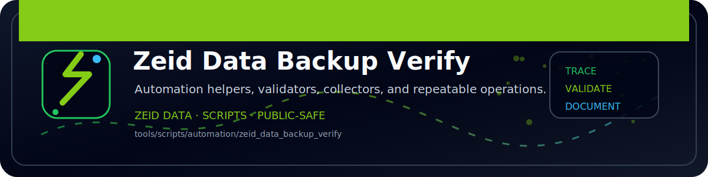

<!-- ZEID DATA README BANNER START -->

  

<!-- ZEID DATA README BANNER END -->

# zeid_data_backup_verify (Python)

Verifies backups are present and fresh.

Outputs:
- `out/backup_verify.json`
- `out/backup_verify.csv`
