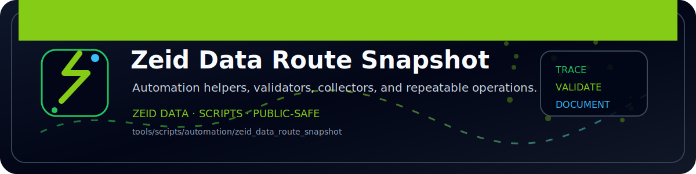

<!-- ZEID DATA README BANNER START -->

  

<!-- ZEID DATA README BANNER END -->

# zeid_data_route_snapshot (Python)

Captures route table snapshots and optional diffs.

Outputs:
- `out/routes_<timestamp>.txt`
- `out/routes_diff_<timestamp>.patch` (optional)
