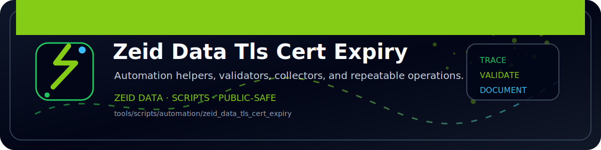

<!-- ZEID DATA README BANNER START -->

  

<!-- ZEID DATA README BANNER END -->

# zeid_data_tls_cert_expiry (Python)

Checks TLS cert expiry for host:port targets.

Outputs:
- `out/tls_cert_expiry.json`
- `out/tls_cert_expiry.csv`
