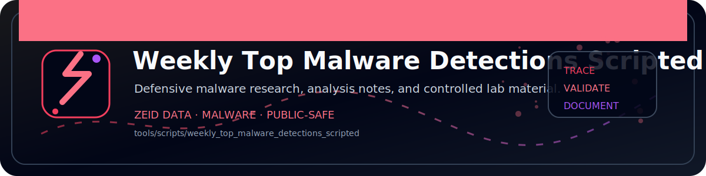

<!-- ZEID DATA README BANNER START -->

  

<!-- ZEID DATA README BANNER END -->

# Zeid Data Detection Scripts (Pack)

This ZIP contains 10 detection/hunting scripts across common security stacks:

- PowerShell (Windows EventLog/Sysmon)
- Microsoft Sentinel (KQL)
- Splunk (SPL)
- Sigma (YAML)
- YARA
- Bash (Linux sweep)
- Zeek
- Python (file share sweep)

Naming convention: zeid_data_<original_filename>

Run/ingest prerequisites are noted in each file header.
