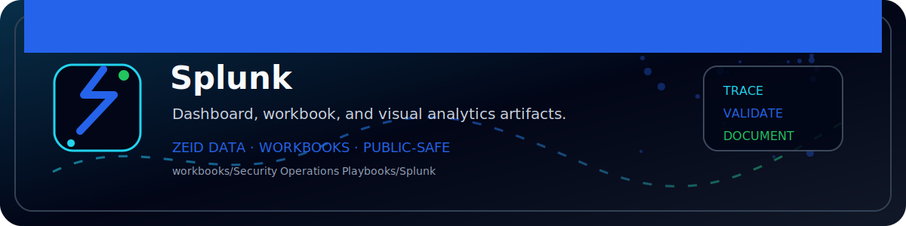

<!-- ZEID DATA README BANNER START -->

  

<!-- ZEID DATA README BANNER END -->

# Zeid Data Security Playbooks — Splunk

**Authorized SOC use only. Use only on systems/data you own or have explicit permission to analyze.**

**Assumed vendor stack:** Splunk Enterprise Security (ES) + core indexes

## Assumed log sources (make assumptions)
- Splunk ES Notable Events
- Risk-based alerting (RBA) signals (if enabled)
- Core indexes: auth, endpoint, network, cloud (assumed)

## SIEM assumptions (examples)
- Splunk: `notable, risk, index=* (by data model: Authentication, Endpoint, Network_Traffic, Change)`
- Sentinel: ``

## Playbooks in this folder
- PB01 Suspicious Authentication
- PB02 MFA Abuse and Push Fatigue
- PB03 Privileged Change or Admin Grant
- PB04 Malicious Process or EDR Detection
- PB05 Data Exfiltration and Large Transfers
- PB06 Command and Control Beaconing
- PB07 Lateral Movement
- PB08 Ransomware or Destructive Activity
- PB09 Insider Risk and Sensitive Access
- PB10 OAuth Token / API Key Misuse
