<!-- ZEID DATA README HERO START -->

  

  
  
  
  
  
  
  
  

<!-- ZEID DATA README HERO END -->

# Zeid Data Workbooks

Evidence-first workbooks, dashboards, and notebooks for Security Operations and compliance reporting.

These artifacts are built to be:
- Deployable (repeatable setup, clear prerequisites)
- Defensible (documented assumptions, transparent logic)
- Operational (SOC-ready views for triage and reporting)
- Audit-ready (supports evidence capture and repeatable outputs)

If it didn’t generate evidence, it didn’t happen.

---

## What this repository contains

This repository stores Zeid Data workbook-style content for multiple platforms, such as:
- SOC dashboards (alerts, triage, investigations, trends)
- Compliance reporting views (controls-aligned summaries, retention visibility)
- Detection coverage and tuning views (noise reduction, fidelity checks)
- Data quality validation (missing fields, normalization drift, ingestion gaps)
- Evidence capture helpers (time-bounded exports, “proof pack” snapshots)

Workbooks are organized by vendor/platform so you can deploy only what you use.

