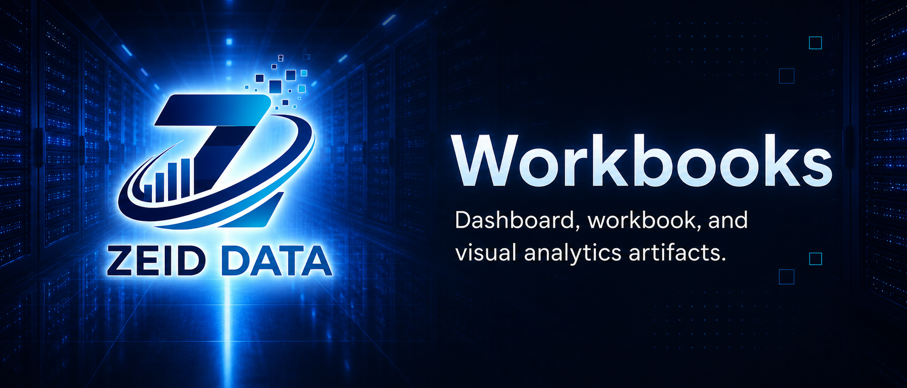

<!-- ZEID DATA README HERO START -->

  

  
  
  
  
  
  
  
  

<!-- ZEID DATA README HERO END -->

# Zeid Data Security Playbooks — Databricks

**Authorized SOC use only. Use only on systems/data you own or have explicit permission to analyze.**

**Assumed vendor stack:** Workspace audit logs (Delivery to S3/ADLS/Log Analytics), cluster & job events

## Assumed log sources (make assumptions)
- Workspace audit logs (cluster/job/notebook events)
- Token/PAT events (where logged)
- Access events for external locations (if used)

## SIEM assumptions (examples)
- Splunk: `index=databricks* sourcetype=databricks:audit`
- Sentinel: `DatabricksAudit_CL (custom) / Log Analytics ingestion`

## Playbooks in this folder
- PB01 Suspicious Authentication
- PB02 MFA Abuse and Push Fatigue
- PB03 Privileged Change or Admin Grant
- PB04 Malicious Process or EDR Detection
- PB05 Data Exfiltration and Large Transfers
- PB06 Command and Control Beaconing
- PB07 Lateral Movement
- PB08 Ransomware or Destructive Activity
- PB09 Insider Risk and Sensitive Access
- PB10 OAuth Token / API Key Misuse
