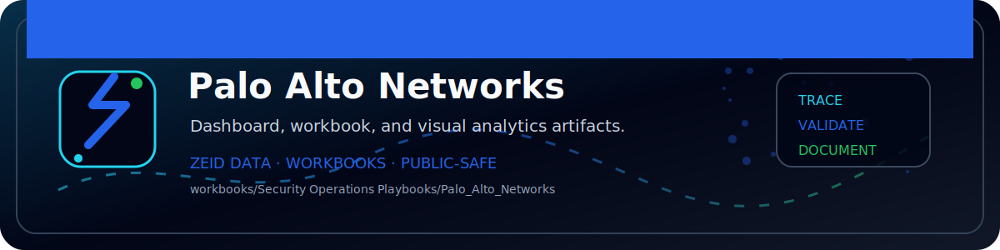

<!-- ZEID DATA README BANNER START -->

  

<!-- ZEID DATA README BANNER END -->

# Zeid Data Security Playbooks — Palo Alto Networks

**Authorized SOC use only. Use only on systems/data you own or have explicit permission to analyze.**

**Assumed vendor stack:** PAN-OS + Prisma Access/GlobalProtect + WildFire (assumed)

## Assumed log sources (make assumptions)
- PAN-OS Traffic logs
- Threat logs (IPS/AV)
- URL Filtering logs
- GlobalProtect auth logs (if used)
- WildFire submissions (assumed)

## SIEM assumptions (examples)
- Splunk: `index=pan* sourcetype in (pan:traffic, pan:threat, pan:url, pan:globalprotect)`
- Sentinel: `CommonSecurityLog (CEF), Syslog (if used)`

## Playbooks in this folder
- PB01 Suspicious Authentication
- PB02 MFA Abuse and Push Fatigue
- PB03 Privileged Change or Admin Grant
- PB04 Malicious Process or EDR Detection
- PB05 Data Exfiltration and Large Transfers
- PB06 Command and Control Beaconing
- PB07 Lateral Movement
- PB08 Ransomware or Destructive Activity
- PB09 Insider Risk and Sensitive Access
- PB10 OAuth Token / API Key Misuse
